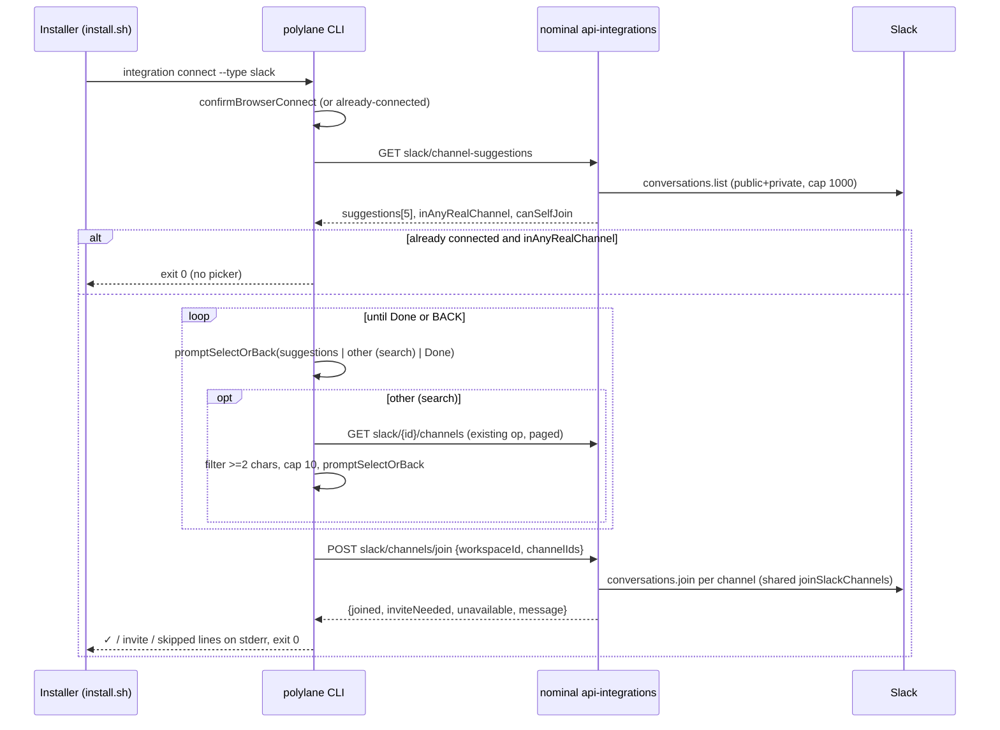
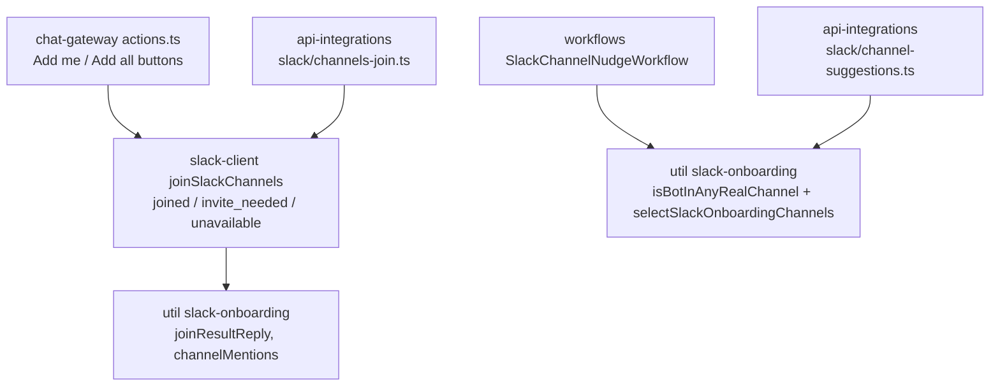

# Slack Channel Picker at Install - Plan

## Goal Capsule

- **Objective:** When the Slack app connects during the CLI install flow, the terminal offers a short scored list of the workspace's public channels and joins Polylane to the ones the installer picks, so a fresh install ends with the bot in at least one real channel.
- **Product authority:** The Product Contract below. Product Key Decisions carry `session-settled` labels and win on behavior; KTDs win on mechanism within their cited Rs.
- **Repos:** `nominal` (API routes + shared join helper), `cli` (this repo — the picker), `polylanedotcom` (installer gate). Paths are repo-relative and prefixed `nominal/` or `polylanedotcom/` when not in this repo.
- **Sequencing:** nominal ships and deploys first; the CLI regenerates its client from the live spec, so the CLI PR lands after the nominal deploy; the installer change lands after the CLI release that carries the picker.
- **Stop conditions:** Stop and surface if a nominal route cannot be added without duplicating scoring or join logic, if `channels:join` is absent from the manifests, or if the CLI cannot obtain the Slack integration id on the fresh-connect path without new plumbing.
- **Tail ownership:** Each repo's PR follows that repo's review loop (`REVIEW.md`); a human merges.

---

## Product Contract

Product Contract preservation: restructured, no scope change — R8 now names three join outcomes (`joined`, `invite_needed`, `unavailable`); R3's follow-up line is pinned to a real command; R10–R11 added for the exit-code contract and the installer re-run the user brought into scope during planning.

### Summary

Add a channel step to `polylane integration connect --type slack`: after the browser OAuth succeeds, show the top-scored public channels plus an "other (search)" option, let the installer pick one or more, and join Polylane to them before the flow ends. Suggestions, joins, and the can't-join fallback are served by nominal so the CLI and the existing Slack DM share one implementation. The hosted installer re-runs the Slack leg when the installed CLI supports the picker.

### Problem Frame

Polylane's Slack experience only starts once the bot is in a channel where alerts, deploys, or incidents land. Installs today finish with the bot in zero channels. Nominal #1452 added a welcome DM and weekly nudge with "Add me" buttons, but the installers observed on 2026-08-24 never acted on the DM — a message that arrives in Slack after the person has already moved on is easy to ignore. The hosted installer already asks "Connect Slack?" in the terminal and waits for OAuth to finish; that moment has the installer's full attention and is the one place nobody has been asked to pick a channel.

### Key Decisions

- **Pick-and-join in the terminal, not a text hint.** (session-settled: user-directed — chosen over printing `/invite @Polylane` instructions only: text-only is the same nudge installers already ignore.) Governs R1, R7.
- **Nominal serves suggestions, joins, and fallback; the CLI renders.** (session-settled: user-approved — chosen over porting #1452's scoring into the CLI: one implementation keeps the DM and terminal lists identical and avoids drift.) Governs R4, R7, R8.
- **Can't-join falls back to the per-channel `/invite` line, no re-auth detour.** (session-settled: user-approved — chosen over re-opening OAuth with the `channels:join` scope mid-install: keeps install short; matches #1452's Slack-side behavior.) Governs R8.
- **One plan spans cli, nominal, and the hosted installer.** (session-settled: user-directed — chosen over a CLI+nominal plan with the installer out of scope: the installer skips the Slack leg once connected, so without it the re-offer path never runs for a real install.) Governs R11.
- **Public channels only.** Same rule as #1452: private channels cannot be self-joined and should not be named in front of whoever installed the app. Governs R4.

### Actors

- A1. **Installer** — the person running the hosted installer or `polylane integration connect --type slack` in a TTY. Has just authorized the Slack app in the browser.
- A2. **Polylane CLI** — renders the picker, calls nominal, prints outcomes.
- A3. **Nominal API** — lists and scores channels for a Slack integration, joins channels, reports why a join was not possible.
- A4. **Hosted installer** (`polylane.com/install`) — drives the CLI connect legs and records step outcomes.

### Requirements

**Trigger and placement**

- R1. Immediately after the CLI confirms the Slack app connected in the connect flow, and before the flow ends, the installer is shown the channel step.
- R2. On a re-run where Slack is already connected, the channel step is still offered when Polylane is in no channel other than its own notifications channel; otherwise the run short-circuits as it does today.
- R3. The step is skipped without a prompt in non-interactive, JSON-output, and dry-run modes, printing one stderr status line: `Add Polylane to Slack channels any time: polylane integration connect --type slack`.
- R10. The channel step never changes the command's exit status: cancelling the picker, an empty selection, or any nominal or Slack error ends the step, prints the R3 line, and the connect result stays "connected" with exit code 0.
- R11. The hosted installer runs `polylane integration connect --type slack` even when Slack is already connected, provided the installed CLI version supports the channel step; older CLIs keep today's skip.

**Suggestions**

- R4. The list shows up to five public, non-archived channels the bot is not already in, ranked by the same keyword-then-size scoring #1452 uses, each with its one-line pitch.
- R5. The list ends with an "other (search)" choice that lets the installer filter the workspace's public channels by a name fragment of at least two characters, showing at most ten matches, and add one match to the selection.
- R6. When no channel qualifies for the list, the step still offers search; when the workspace has no joinable public channel at all, the step prints that and ends.

**Selection and join**

- R7. The installer builds a selection of zero or more channels and confirms with a "Done" entry; confirming joins Polylane to each selected channel and prints a per-channel result. Confirming with none selected ends the step with no join.
- R8. Each selected channel ends in exactly one of three outcomes, decided by nominal and shared with the Slack DM buttons: `joined` (✓ line), `invite_needed` (token lacks `channels:join` or Slack refuses the self-join — printed with the exact `/invite @Polylane` instruction for that channel), or `unavailable` (archived or deleted since suggestion — printed as skipped, no instruction). One channel's outcome never stops the others.
- R9. A failed suggestions request or a failed join request as a whole is treated per R10.

### Key Flows

- F1. **Fresh install, happy path**
  - **Trigger:** Installer answers Y to "Connect Slack?", finishes OAuth in the browser, CLI prints the connected line.
  - **Actors:** A1, A2, A3, A4
  - **Steps:** CLI requests suggestions → renders the list with five channels, "other (search)", and "Done" → installer picks #alerts, then #deploys, then Done → CLI requests joins → prints ✓ per channel.
  - **Outcome:** Bot is in two channels; the nominal nudge workflow stops on its own at its next check.
  - **Covered by:** R1, R4, R7
- F2. **Search for a channel not in the list**
  - **Trigger:** Installer picks "other (search)".
  - **Steps:** Installer types `infra` → CLI shows up to ten matching public channels → installer picks one → returns to the list with the selection preserved → Done → joins proceed as F1.
  - **Covered by:** R5, R7
- F3. **Older install without join scope**
  - **Trigger:** Same as F1, but the workspace's Slack token predates `channels:join`.
  - **Steps:** Joins are attempted → nominal reports each as `invite_needed` → CLI prints "#alerts — run `/invite @Polylane` in that channel" per selection.
  - **Outcome:** Installer has the exact next action; install ends without re-auth.
  - **Covered by:** R8
- F4. **Re-install with Slack connected and the bot in zero channels**
  - **Trigger:** Installer re-runs the hosted installer; Slack is already connected.
  - **Steps:** Installer detects a CLI version with the channel step → runs the connect command → CLI prints the already-connected line → requests suggestions → learns the bot is in no real channel → shows the picker as F1.
  - **Covered by:** R2, R11

### Acceptance Examples

- AE1. **Covers R1, R7.** Given Slack just connected in a TTY, when the installer selects #alerts then Done, then the terminal prints a ✓ for #alerts and the bot is a member of #alerts before the command exits.
- AE2. **Covers R4.** Given a workspace with #general (900 members), #alerts (40), #datadog (12), and the bot already in #polylane-notifications, when the list renders, then #alerts and #datadog rank above #general and #polylane-notifications is absent.
- AE3. **Covers R5.** Given #infra-eu is not in the top five, when the installer chooses "other (search)" and types `infra`, then #infra-eu is offered and can be added to the selection.
- AE4. **Covers R7, R10.** Given the picker is shown, when the installer picks Done with nothing selected, then no join is attempted and the command exits 0.
- AE5. **Covers R8.** Given the token lacks `channels:join`, when the installer selects #alerts and #deploys, then both are reported with their `/invite @Polylane` line and the command exits 0.
- AE6. **Covers R2.** Given Slack is already connected and the bot is only in #polylane-notifications, when `polylane integration connect --type slack` runs without `--reconnect`, then the already-connected message is followed by the channel step.
- AE7. **Covers R3.** Given `--non-interactive` or `--output json`, when Slack connects, then no picker appears and the R3 line is printed to stderr.
- AE8. **Covers R9, R10.** Given nominal returns an error for the suggestions request, when the step runs, then the CLI prints the R3 line and the connect flow still reports Slack as connected with exit code 0.
- AE9. **Covers R8.** Given #old-alerts was archived after it was suggested, when the installer selects it, then it is reported as skipped with no `/invite` instruction and the other selections still proceed.
- AE10. **Covers R10.** Given the picker is on screen, when the installer presses Ctrl+C, then the step ends, the R3 line prints, and the command exits 0.
- AE11. **Covers R11.** Given Slack is already connected and the installed CLI reports a version at or above the picker release, when the hosted installer runs, then it invokes `polylane integration connect --type slack` instead of marking `connect.slack.skipped`.
- AE12. **Covers R11.** Given Slack is already connected and the installed CLI reports an older version, when the hosted installer runs, then it marks `connect.slack.skipped` as today.
- AE13. **Covers R6.** Given a workspace whose only public channels are ones the bot is already in, when the step runs and a search for `eng` returns nothing, then the terminal prints that there is no channel to join, attempts no join, and the command exits 0.

### Success Criteria

- A brand-new workspace that accepts the Slack step during install has the bot in at least one channel other than its notifications channel when the installer finishes, verified live on a fresh workspace.
- For workspaces under the 1000-channel scan cap, the terminal list and the #1452 welcome-DM list show the same channels in the same order.

### Scope Boundaries

- Private channels — not listed, not joinable, same as #1452.
- Changes to the Slack welcome DM or weekly nudge — unchanged; the nudge already stops once the bot is in a channel.
- Re-authorizing Slack from the CLI to acquire `channels:join` — deferred; the `/invite` fallback covers older installs.
- Auto-joining without asking — rejected; the installer chooses.
- A first-class `polylane integration slack-channels` verb — deferred; the new ops are reachable through `polylane api call` and the connect flow. Add a verb only if it earns one.

#### Deferred to Follow-Up Work

- Suppressing the welcome DM when the picker already joined channels (the DM still fires from the OAuth callback and may land while the picker is on screen).
- Rendering `/invite @<bot name>` from `metadata.data.botUserId` for workspaces that renamed the app.

### Dependencies / Assumptions

- The Slack app manifests already carry `channels:join`; new installs can self-join public channels. Existing installs keep their old token until re-authorized.
- The CLI's OAuth scopes and owner API keys already include `integrations:read` and `integrations:write`; no scope work.
- Ctrl+C during the browser wait exits the CLI process, so an installer who interrupts the wait never reaches the step; the DM nudge remains their path.
- The Slack integration row is created only after the bot token is stored, so the token is usable the moment the CLI sees the row.

### Sources / Research

- Request: Slack thread from Boris, 2026-08-24 (https://coreplanelabs.slack.com/archives/C0AUX3Y3W4Q/p1787615066723439).
- Prior art: nominal PR #1452 (https://github.com/coreplanelabs/nominal/pull/1452).
- Multi-select rejected in this flow: `cli` commit `7071403` ("space toggles and enter confirms reads as a dead enter key"), reverting `5619cb1`.
- Nominal route conventions: `nominal/.claude/skills/api-routes/SKILL.md` (POST authz reads `workspaceId` from the body; mutations emit an internal event; no `.openapi()` schemas in `@nominal/util`; schema conversion failures silently drop the whole service from the spec).
- CLI codegen source: `codegen/fetch-spec.ts` (`https://${POLYLANE_API_DOMAIN || 'api.polylane.com'}/v1/doc`); `src/generated/` is gitignored and rebuilt by `pretypecheck`.
- Installer Slack leg and version gate: `polylanedotcom/src/assets/install.sh` (`has_connected slack` skip; `cli_has_code_agent_offer` version parser).

---

## Planning Contract

### Key Technical Decisions

- KTD1. **Two nominal routes, integration id explicit.** `GET /integrations/{workspaceId}/slack/{id}/channel-suggestions` (operationId `integrations.slack.channelSuggestions`, scope `INTEGRATIONS_READ`) and the un-hidden single-channel `POST /integrations/slack/channels/join` from nominal #1515 (operationId `integrations.slack.channels.join`, scope `INTEGRATIONS_WRITE`, `workspaceId` + `integrationId` + `channelId` in the body; the CLI joins selected channels sequentially). Both take the integration id explicitly, mirroring the existing channel-list route; the CLI recovers the id on the fresh path with one more `baseline.check()` call after the browser wait. Chosen at implementation time over a new batch route with implicit resolution because #1515 had already landed the join route the same day. Governs R1, R2, R4, R8.
- KTD2. **Suggestions route returns membership state too.** Response: `{ suggestions: [{id, name, pitch}], inAnyRealChannel, notificationsChannelId, canSelfJoin, truncated }`. One Slack scan (`listAllConversations`, both channel types) feeds `selectSlackOnboardingChannels` and the "in any real channel" predicate from `SlackChannelNudgeWorkflow`, so R2 costs one round-trip and the list cannot drift from the DM. `canSelfJoin` is `botScope.includes("channels:join")`. Governs R2, R4.
- KTD3. **One shared join helper with three outcomes.** Extract `joinSlackChannels(client, channels)` into `nominal/packages/slack-client` returning `{ joined, inviteNeeded, unavailable }`, using the existing `SELF_JOIN_BLOCKED_ERRORS` set split so `is_archived` and `channel_not_found` map to `unavailable`. `joinResultReply` and `channelMentions` move to `nominal/packages/util/slack-onboarding.ts`. `actions.ts` button handlers and the join route both call these. (session-settled: user-approved — chosen over a route-private join loop: the user required one code path for DM buttons and API.) Governs R8.
- KTD4. **Repeat-select loop, not multi-select.** The picker is `promptSelectOrBack` in a loop: suggestions not yet selected, "other (search)", "Done". Selected channels are shown in the message line. `BACK` from any prompt ends the step per R10. Chosen over `@clack/prompts` `multiselect` because that shape was shipped and reverted in this flow (commit `7071403`) and the loop needs no new prompt primitive. Governs R7, R10.
- KTD5. **Search reuses the existing channel list op.** "other (search)" runs `promptTextOrBack`, then filters the public channels returned by the existing `integrationsSlackChannels` op (already generated in the CLI; since #1515 it returns the full list in one response, no cursor) client-side by substring, caps at ten, and presents them through `promptSelectOrBack`. No new nominal route for search. Governs R5.
- KTD6. **Never-fail is structural.** The step is one function wrapped in a single try/catch that prints the R3 line on any error, uses only `*OrBack` prompts (which return `BACK` instead of throwing), and returns nothing to the caller; `connectType` returns its existing outcome unchanged. `src/main.ts` already exits 0 after a successful `execute`. Between prompts (the suggestions and join spinners) the CLI's global SIGINT handler would exit 130, so the step installs a scoped `process.once('SIGINT')` handler for its duration that stops the spinner, prints the R3 line, and exits 0, removed in `finally` — the same shape `waitForBrowserCompletion` uses in `src/commands/helpers.ts`. Governs R9, R10.
- KTD7. **Mode gate reuses `canWaitForBrowser`.** The step runs only when `canWaitForBrowser(config)` is true (`!dryRun && output !== 'json' && interactive`) — the same predicate that decides whether `confirmBrowserConnect` waited. The R3 line is a status line on stderr, not a `hints`-gated note, because the hosted installer sets `POLYLANE_HINTS=0`. Governs R3.
- KTD8. **Installer gate is a version check; membership is the CLI's job.** `install.sh` gains `cli_has_slack_channel_picker` (same parser shape as `cli_has_code_agent_offer`, threshold = the CLI release that ships U4–U5) and runs the Slack connect leg when connected and the gate passes; the CLI's R2 path decides whether to show anything. The installer's `connect.slack.*` marks are unchanged in meaning. Governs R11.
- KTD9. **Join route emits an internal event.** Per nominal's api-routes rule, the mutation emits `slack.channels.joined` with channel counts per outcome (no channel names), wired through the internal-events checklist. Governs R8.

### High-Level Technical Design

Shared code after U1 (both surfaces call the same functions):

### Assumptions

- The CLI release that first carries the picker is not yet known; U6 pins the version threshold when U4–U5 are released.
- `listAllConversations` with both channel types returns `isMember` for private channels the bot is in, which is what the nudge workflow already relies on.

### Open Questions

**Deferred to Planning → resolved above.** None block implementation.

**Deferred to implementation**

- Exact operationIds are proposed in KTD1; if nominal's OpenAPI merge or the CLI's method-name derivation (`codegen/parse-spec.ts`) produces a collision, adjust the id before the CLI unit starts.
- Whether the join route joins sequentially or with bounded concurrency; Slack's `conversations.join` is Tier 3, and selections are small.

---

## Implementation Units

### U1. Shared join helper and predicates (nominal)

- **Goal:** One join-with-fallback code path and one "in any real channel" predicate, used by DM buttons, workflow, and the new routes.
- **Requirements:** R8, R2 (KTD3, KTD2)
- **Dependencies:** none
- **Files:**
  - `nominal/packages/slack-client/src/index.ts` — add `joinSlackChannels`, export `SELF_JOIN_BLOCKED_ERRORS` split into invite-needed and unavailable sets
  - `nominal/packages/util/slack-onboarding.ts` — add `joinResultReply`, `channelMentions`, `isBotInAnyRealChannel`; types for the outcome partition
  - `nominal/apps/chat-gateway/src/handlers/actions.ts` — replace `joinSuggestedChannel` and the add-all loop with the shared helper
  - `nominal/packages/workflows/slack-channel-nudge/SlackChannelNudgeWorkflow.ts` — use `isBotInAnyRealChannel`
  - `nominal/apps/apis/api-integrations/src/routers/integrations/slack/integration.ts` — new; `resolveSlackIntegration` moved out of `channel-proactive.ts` and exported
  - Tests: `nominal/packages/util/slack-onboarding.test.ts`, `nominal/apps/chat-gateway/src/handlers/actions.test.ts`, `nominal/packages/workflows/slack-channel-nudge/SlackChannelNudgeWorkflow.test.ts`
- **Approach:**
  1. Move mechanics into `slack-client` (zero-dependency package: return structured results, no logging).
  2. Move copy into `util` as pure string functions; no `.openapi()` there.
  3. Refactor `actions.ts` so single-channel and add-all handlers collapse to one call; `unavailable` channels get a short "no longer available" clause in the reply.
  4. Extract `resolveSlackIntegration` for reuse by U2 and U3.
- **Execution note:** Characterization first — keep `actions.test.ts:173` and `:193` green before touching the handlers.
- **Patterns to follow:** free functions in `slack-client/src/index.ts` (`listAllConversations`); pure helpers in `slack-onboarding.ts`.
- **Test scenarios:**
  - `joinSlackChannels` maps `already_in_channel` to `joined`.
  - Maps `missing_scope`, `method_not_supported_for_channel_type`, `not_allowed_token_type` to `invite_needed`.
  - Maps `is_archived`, `channel_not_found` to `unavailable`.
  - Rethrows an unknown Slack error code.
  - Add-all button with a mixed batch posts a reply containing `/invite @Polylane` and the joined mentions (existing assertion preserved).
  - `isBotInAnyRealChannel` is false when the only membership is the notifications channel; true when any other `isMember` channel exists; handles missing `notificationsChannelId`.
- **Verification:** `task test` green in the three packages; `actions.ts` no longer defines a join loop.

### U2. Channel suggestions route (nominal)

- **Goal:** `GET /integrations/{workspaceId}/slack/channel-suggestions` returning the same list the welcome DM shows plus membership state.
- **Requirements:** R2, R4, R6 (KTD1, KTD2); AE2
- **Dependencies:** U1
- **Files:**
  - `nominal/apps/apis/api-integrations/src/routers/integrations/slack/channel-suggestions.ts` — new
  - `nominal/apps/apis/api-integrations/src/routers/integrations/slack/channel-suggestions.test.ts` — new
  - `nominal/apps/apis/api-integrations/src/routers/integrations/slack/index.ts` — register
  - `nominal/apps/apis/api-integrations/src/routers/integrations/slack/onboarding.ts` — `sendInstallerWelcome` calls the same selection helper path (no behavior change)
- **Approach:**
  1. Copy the `channels.ts` route skeleton; resolve the integration with `resolveSlackIntegration`; decrypt `botTokenCipher` read-only.
  2. One `listAllConversations` call with both channel types; `selectSlackOnboardingChannels(channels, [notificationsChannelId])` for the list; `isBotInAnyRealChannel` for the flag; `truncated` when the cap was hit; `canSelfJoin` from `metadata.data.botScope`.
  3. Plain zod primitives only in the response schema.
- **Patterns to follow:** `channels.ts` (route shape, status codes, `handleError`), `channel-proactive.ts` (implicit resolution), `github/link.test.ts` (route test scaffolding).
- **Test scenarios:**
  - Returns five scored suggestions excluding the notifications channel and member channels (mirror AE2 fixture).
  - `inAnyRealChannel` false when only the notifications channel is joined; true otherwise.
  - `canSelfJoin` false when `botScope` lacks `channels:join`.
  - 404 when the workspace has no live Slack integration.
  - Empty `suggestions` with `truncated: false` for a workspace with no public channels.
- **Verification:** route appears in `/v1/doc` under operationId `integrations.slack.channelSuggestions`; `task do` green.

### U3. Channel join route with internal event (nominal)

- **Goal:** `POST /integrations/slack/channels/join` joining selected channels through the shared helper and returning the three-way outcome plus the DM-identical message.
- **Requirements:** R7, R8 (KTD1, KTD3, KTD9); AE5, AE9
- **Dependencies:** U1
- **Files:**
  - `nominal/apps/apis/api-integrations/src/routers/integrations/slack/channels-join.ts` — new
  - `nominal/apps/apis/api-integrations/src/routers/integrations/slack/channels-join.test.ts` — new
  - `nominal/apps/apis/api-integrations/src/routers/integrations/slack/index.ts` — register
  - Internal event wiring per `nominal/.claude/skills/internal-events/SKILL.md`: `nominal/packages/internal-event-bus/src/index.ts`, `nominal/packages/internal-events/schemas/*`, `nominal/apps/bridge/bridge.config.ts`
  - `nominal/docs/architecture/09-ingestion-and-surfaces.md` — note the CLI-facing Slack onboarding surface
- **Approach:**
  1. Body schema `z.strictObject({ workspaceId, channelIds: z.array(z.string()).min(1).max(25) })`; POST reads `workspaceId` from the body for authz.
  2. Resolve integration, decrypt token, call `joinSlackChannels`, build `message` with `joinResultReply`.
  3. Emit `slack.channels.joined` with counts per outcome.
  4. Response `{ joined: [{id,name}], inviteNeeded: [...], unavailable: [...], message }`.
- **Patterns to follow:** `slack/generate.ts` (POST with `workspaceId` in body), `channel-instructions.ts` (body route), internal-events skill checklist.
- **Test scenarios:**
  - Mixed batch partitions correctly and `message` contains `/invite @Polylane` for invite-needed channels.
  - Archived channel lands in `unavailable` with no invite text.
  - 403 when `workspaceId` is missing from the body.
  - Emits exactly one internal event with correct counts.
  - Rejects more than 25 channel ids with 400.
- **Verification:** `task do` green; event visible in the bridge route config; `/v1/doc` lists `integrations.slack.channels.join`.

### U4. CLI channel step module (cli)

- **Goal:** The picker loop and result printing as pure functions plus one orchestrating `runSlackChannelStep`, wired into both seams of `connectType`.
- **Requirements:** R1, R2, R3, R4, R6, R7, R8, R9, R10 (KTD4, KTD6, KTD7); AE1, AE4–AE8, AE10, AE13
- **Dependencies:** U2, U3 deployed to the API the codegen reads (`POLYLANE_API_DOMAIN` may point at UAT for local work)
- **Files:**
  - `src/commands/integration/slack-channels.ts` — new: `shouldOfferSlackChannels`, `pickerOptions`, `formatJoinResults`, `SLACK_CHANNELS_LATER_LINE`, `runSlackChannelStep`
  - `src/commands/integration/connect.ts` — call the step after `confirmBrowserConnect` returns `'connected'` with a non-null check, and on the already-connected short-circuit
  - `test/integration-connect-slack-channels.test.ts` — new
- **Approach:**
  1. Gate: `canWaitForBrowser(config)`; on the already-connected path also require `!inAnyRealChannel` from the suggestions response.
  2. Fetch suggestions under a `Spinner` (stderr). Empty list → search-only options per R6; `suggestions` empty and search yields nothing → print the R6 line and return.
  3. Loop `promptSelectOrBack` over unselected suggestions (label `#name`, hint = pitch), "other (search)", "Done"; the message line lists current selections. `BACK` anywhere → R3 line, return.
  4. Done with selections → join call → print one stderr line per channel from `formatJoinResults` (✓ / `/invite @Polylane` / skipped). When `canSelfJoin` is false, still attempt the join and print the API's outcome.
  5. Whole function in one try/catch; any error → R3 line. Install the scoped SIGINT handler from KTD6 on entry and remove it in `finally`.
- **Execution note:** Implement the pure functions test-first; the orchestrator is covered by scenario tests that stub the API and the prompt module.
- **Patterns to follow:** `shouldOfferCodeAgent` + `promptConfirmOrBack` post-step at `connect.ts:831-845`; stderr `✓` lines at `connect.ts:270`; `Spinner` in `src/output/progress.ts`; API fakes cast through `unknown` (`test/connect-baseline.test.ts`); `mock.module('../src/utils/prompt', …)` before import when prompts must be stubbed (`test/onboarding-run.test.ts`).
- **Test scenarios:**
  - `shouldOfferSlackChannels` is false for dry-run, json output, non-interactive; true for a TTY text run.
  - `pickerOptions` excludes already-selected channels and always ends with search and Done; renders pitch as hint.
  - `formatJoinResults` prints ✓, `/invite @Polylane`, and skipped lines for the three buckets. Covers AE5, AE9.
  - Done with no selection makes no join call. Covers AE4.
  - Suggestions request rejects → R3 line printed, no throw. Covers AE8.
  - `BACK` from the picker → R3 line, no join. Covers AE10.
  - SIGINT during the stubbed suggestions call → spinner stopped, R3 line printed, exit code 0. Covers AE10.
  - Empty suggestions and a search that yields nothing → R6 line printed, no join, step ends. Covers AE13.
  - Already-connected path with `inAnyRealChannel: true` prints nothing extra; with `false` runs the picker. Covers AE6.
  - `test/integration-connect-category.test.ts` option count unchanged.
- **Verification:** `npm run codegen && npm run typecheck && npm run lint && npm test` green; manual TTY run against UAT shows the picker after `✓ the Slack app connected`.

### U5. Search sub-step (cli)

- **Goal:** "other (search)" adds one public channel by name fragment using the existing channel-list op.
- **Requirements:** R5 (KTD5); AE3
- **Dependencies:** U4
- **Files:**
  - `src/commands/integration/slack-channels.ts` — `filterChannels`, `searchChannel`
  - `test/integration-connect-slack-channels.test.ts` — extend
- **Approach:**
  1. `promptTextOrBack` for the fragment; fewer than two characters → re-prompt once, then return to the loop.
  2. Page `integrationsSlackChannels` (needs the integration id: take `baseline.existing[0].id` on the already-connected path, `baseline.check()` result on the fresh path) up to the 1000 cap, filter `!isPrivate && !isMember`, substring match on name, cap ten.
  3. `promptSelectOrBack` over matches with a Back entry; a pick is appended to the selection and the loop resumes.
- **Patterns to follow:** cursor paging as in other list commands; `promptTextOrBack` usage in `connect.ts`.
- **Test scenarios:**
  - `filterChannels` drops private and member channels, is case-insensitive, caps at ten.
  - Fragment of one character is rejected.
  - Selected search result appears in the subsequent picker message and is excluded from later search results.
  - Channel-list error falls back to the R3 line without ending the whole command (covered by U4's try/catch).
- **Verification:** unit tests green; manual run finds a channel outside the top five.

### U6. Installer re-runs the Slack leg (polylanedotcom)

- **Goal:** The hosted installer invokes the CLI Slack connect leg when Slack is connected and the CLI supports the picker.
- **Requirements:** R11 (KTD8); AE11, AE12
- **Dependencies:** U4–U5 released; the release version pinned into the gate
- **Files:**
  - `polylanedotcom/src/assets/install.sh` — add `cli_has_slack_channel_picker`; change the Slack leg so `has_connected slack && ! cli_has_slack_channel_picker` marks skipped, otherwise runs the connect leg without the "Connect Slack?" question when already connected
  - `polylanedotcom/scripts/test-install.sh` — scenarios for both gate outcomes
- **Approach:**
  1. Copy `cli_has_code_agent_offer`'s parser; threshold is the CLI version from U4's release.
  2. When already connected and gated in, run `run_tty "$BIN" integration connect --type slack` directly (no yes/no — the CLI exits quickly when the bot is already in a channel) and keep marking `connect.slack.accepted`/`failed` as today.
- **Execution note:** Smoke-first — the stub-driven scenario suite is the proof; no unit layer exists for the installer.
- **Patterns to follow:** `cli_has_code_agent_offer` and the `code-agent-skip` scenario in `test-install.sh`.
- **Test scenarios:**
  - Connected Slack + stub version at threshold → `STUB_CONNECT integration connect --type slack` recorded; no `connect.slack.skipped`. Covers AE11.
  - Connected Slack + older stub version → `connect.slack.skipped`. Covers AE12.
  - Unconnected Slack behaves exactly as before (existing golden scenario unchanged).
- **Verification:** `scripts/test-install.sh` all scenarios pass; the `install-bytes` CI leg stays green.

---

## Verification Contract

| Gate | Command | Applies to |
|---|---|---|
| nominal full local CI | `source bin/activate-hermit && task do` | U1–U3 |
| nominal focused tests | `pnpm --filter @nominal/api-integrations test`; `pnpm --filter @nominal/util test` | U1–U3 |
| Spec exposure | `curl -s https://<api>/v1/doc \| jq '.paths \| keys'` shows both new routes | U2, U3 after deploy |
| cli | `npm run codegen && npm run typecheck && npm run lint && npm test` | U4, U5 |
| cli manual | TTY run of `polylane integration connect --type slack` on UAT: picker appears, joins succeed, Ctrl+C exits 0 | U4, U5 |
| installer | `polylanedotcom/scripts/test-install.sh` | U6 |
| Live success criterion | Fresh workspace install ends with the bot in a non-notifications channel; DM list order matches the terminal list | all |

---

## Definition of Done

- All units merged in dependency order; each repo's review loop reached `LGTM` per its `REVIEW.md`.
- Every AE1–AE13 has a passing automated test or a linked manual receipt (AE1, AE3 manual on UAT; AE11–AE12 via `test-install.sh`; AE13 via the U4 unit test).
- `actions.ts` contains no join logic of its own; scoring regexes exist only in `nominal/packages/util/slack-onboarding.ts`.
- The join route's internal event is registered end to end.
- No abandoned-attempt code (no unused multi-select wrapper, no duplicated `/invite` copy) remains in any diff.
- Per unit: its Verification row passes and its test scenarios are present.
